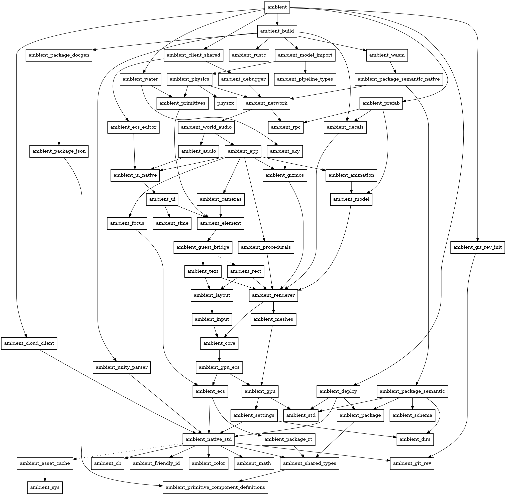

# Runtime internals

This part of the documentation covers how the runtime works internally,
and how you can make changes to it. This is primarily for those who want to contribute
to the Ambient repository itself; most end-users should not need to read this.

## Getting started

To make changes to the runtime itself, start with cloning this repository:

```sh
git clone git@github.com:AmbientRun/Ambient.git
```

If you use VSCode, we then recommend opening two instance of it; one in the
root, and one in `guest/rust`. This is because `guest/rust` has a different
target architecture (WASM), so a separate `rust-analyzer` instance is required
to ensure the workspaces function correctly.

## Running examples from `main` as a developer

If you are a developer actively working on Ambient, you can run the examples from the `guest/rust/examples` directory directly, without having to install Ambient.

1. Clone the GitHub repository.
2. Run the examples in the `guest/rust/example` directory: `cargo run --release -- guest/rust/examples/basics/primitives`

To help with this, the Ambient repository has a tool called [Campfire](../runtime_internals/contributing.md#campfire).
It offers a convenient way to run examples:

```sh
cargo cf run -r primitives
```

The name is based on the end of the path, so additional context can be provided if necessary:

```sh
cargo cf run -r basics/primitives
```

## Dependency graph


