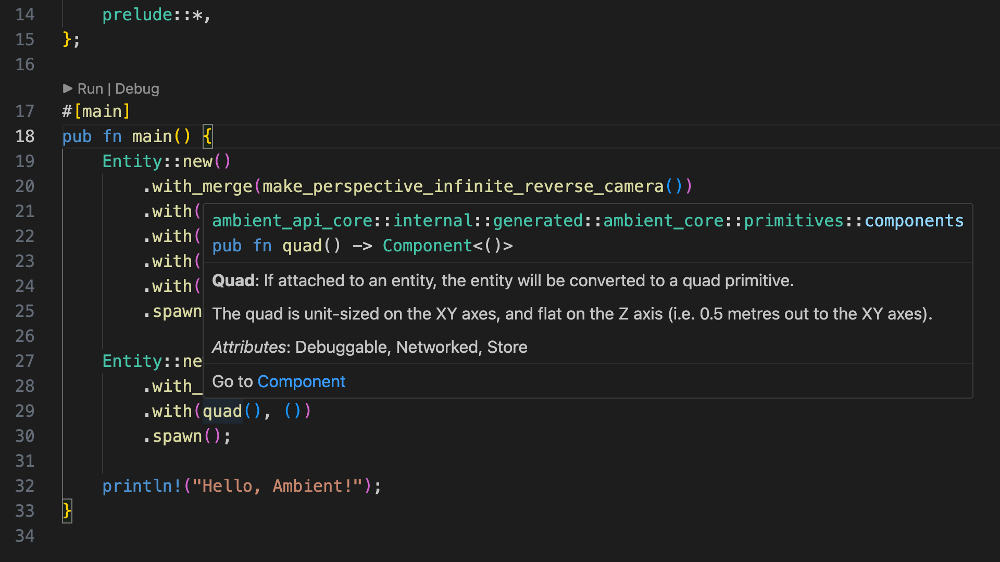

# Chapter 1: Creating a package

To create a new Ambient project, type the following in your terminal of choice after having [installed Ambient](../../user/installing.md):

```sh
ambient new my_project
```

> **Note**: Initial build times can be slow, especially on Windows, where Rust compilation is slower. Subsequent builds will be faster.

This will create a new Ambient package with the default template, which is set up for Rust and creates a quad and a camera.

> **In-depth**: A package is a bundle of code and assets which can be deployed. Read more about packages [here](../../reference/package.md).

Enter the project folder by typing `cd my_project`, and then run it with:

```sh
ambient run
```

You should see a window like this:


> **Tip**: You can also open the project in VS Code by typing `code .` in the folder, `code my_project` from the root folder, or using the right-click menu of your operating system if supported.

> **Tip**: In VS Code, you can hit `F5` to run the project.

> **Tip**: Run with `--debugger` to show the debugger UI (i.e. `ambient run --debugger`). See the [reference documentation on debugging](../../user/debugging.md) for more info.
> In VS Code, you can switch to the "Debug" launch configuration and then press `F5` to do the same.

If you would like to join the session from the same machine with a second client, you can run:

```sh
ambient join
```

However, within Ambient's console output, a line should be present that looks like this:

<pre><code>Proxy allocated an endpoint, use `<span style="color:green">ambient join proxy-eu.ambient.run:9898</span>` to join</code></pre>

This can be used to quickly test a multiplayer game with another machine or with other people. Just copy the green text and send it to a friend to allow them to join your session.

## Package structure

The basic structure of an Ambient package is as follows:

- `my_package/`
  - `ambient.toml`: This is where you define ECS components, messages and other data about your package.
  - `Cargo.toml`: This is Rust's equivalent of `ambient.toml`, which defines Rust-specific metadata like Rust dependencies and more.
  - `assets/`: This folder contains all assets.
    - `pipeline.toml`: A pipeline file decides how the assets will be processsed.
  - `src/`: This folder contains all source code.
    - `client.rs`: This file contains the code that run on your player's computers.
    - `server.rs`: This file contains code that runs on the game server.

> **In-depth**: You can read more about Ambient's ECS [in the ECS reference](../../reference/ecs.md), and about Ambient's asset pipeline [in the asset pipeline reference](../../reference/asset_pipeline.md).

## Client and server?

Ambient targets multiplayer by default, which is why each new package comes with a `server.rs` and `client.rs`. Game logic is typically defined on the server, whereas the client forwards inputs and adds visual effects.

> **In-depth**: For an introduction to the client-server architecture, [go here](../../user/overview.md).

> **Tip**: Unsure about how to arrange your code? Check out [where my code should go](../../reference/faq.md#should-my-code-go-on-the-client-or-the-server).

## IDE setup

If you have installed the [recommended VS Code tools](../../user/setting_up_ide.md), you should be able to hover your mouse over each concept or component to see the docs. The following screenshot is of `server.rs`:



This will also give you auto-completion and a few other handy tools.

> **Tip**: Use `Ctrl-.` (Windows, or `Cmd-.` on macOS) to bring up VS Code suggestions, such as automatic imports. Note that you may have to save after the fix is applied to for any errors or warnings to be updated.

> **Source**: The complete code for this chapter can be found [here](https://github.com/AmbientRun/TutorialProject/tree/chapter-1).

## Challenge

Try creating some cubes and changing their `translation()`, `scale()`, and `rotation()` components.

> **Tip**: You can refer to the [primitives example](https://github.com/AmbientRun/Ambient/blob/main/guest/rust/examples/basics/primitives/src/server.rs) in the Ambient GitHub repository.
>
> **Source**: The complete code for this challenge can be found [here](https://github.com/AmbientRun/TutorialProject/tree/chapter-1-challenge).

## [⇾ Chapter 2: Player character](./2_player_character.md)
