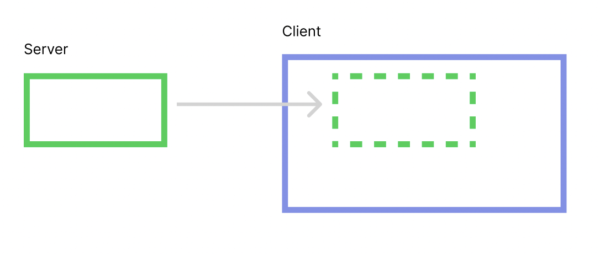

# Overview of Ambient

Let's start with a rough overview of Ambient to give you an idea of how it works.

## The database (ECS)

The most central thing in Ambient is the [ECS](../reference/ecs.md) "world". You can think of it
as a database that stores everything in your application.

The world is a collection of entities. An entity is a collection of components and a component is a
`(name, value)` pair. For example, you could have an entity with two components:

```yml
entity 1932:
  - translation: (5, 2, 0)
  - color: (1, 0, 0, 1)
```

If you compare this to a traditional SQL database, you can think of entities as rows and
components as columns. Note that there is no equivalent of a table, though: any component can be attached to any
entity.

## Client/server

The next thing to know is that Ambient is built around a client/server architecture. Both
the server and the client have a world of their own (green and blue boxes in the image below).



The server's world is automatically replicated to all clients' worlds. The clients can
add additional entities and/or components to their local world. Typically, you'll
have game state on the server (for instance `{ unit: "orc", level: 10 }`), and visual
effects or other client-local state on the clients (for instance, spawn fireworks when
the orc levels up).

Note that the replication is one-way.
Any changes you make to your client world will _not_ be replicated to the server.
To communicate from the client to the server, you will typically use [message passing](../reference/networking.md#messaging) instead.
